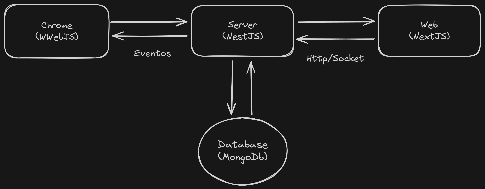

# NetZap

NetZap é uma plataforma que permite a utilização simultânea do WhatsApp por múltiplos usuários, seja com uma única conta ou com várias. O projeto ainda está em desenvolvimento, com melhorias e funcionalidades sendo continuamente implementadas.

## Arquitetura

O NetZap foi construído com base na biblioteca [WWebJS](https://github.com/pedroslopez/whatsapp-web.js), que utiliza o **Chrome** e o [Puppeteer](https://pptr.dev/) para manipular conversas no **WhatsApp**. Com essa base, foi desenvolvida a seguinte arquitetura:

- O **WWebJS** opera com um sistema de eventos.
	- Quando uma mensagem é recebida, o status (ou visibilidade) da mensagem é atualizado e um evento é disparado.
	- Esse evento é capturado pelo back-end (**Server**), que processa os dados e cria uma referência no **MongoDB**.
	- Posteriormente, essa referência é utilizada para enviar dados ao front-end (**Web**) por meio de **HTTP** ou **WebSocket** ([Socket.IO](https://socket.io/)).

- O front-end (**Web**) também pode emitir eventos, como o envio de mensagens.
	- Esses eventos são capturados pelo back-end (**Server**), que aciona o **WWebJS** para realizar a ação correspondente.
	- Após a execução, as referências são criadas no **MongoDB** e o resultado é retornado ao front-end via Socket.IO.

Essa arquitetura garante uma comunicação fluida e eficiente entre o front-end, o back-end e o **WhatsApp**, permitindo manipulação em tempo real e persistência dos dados.
